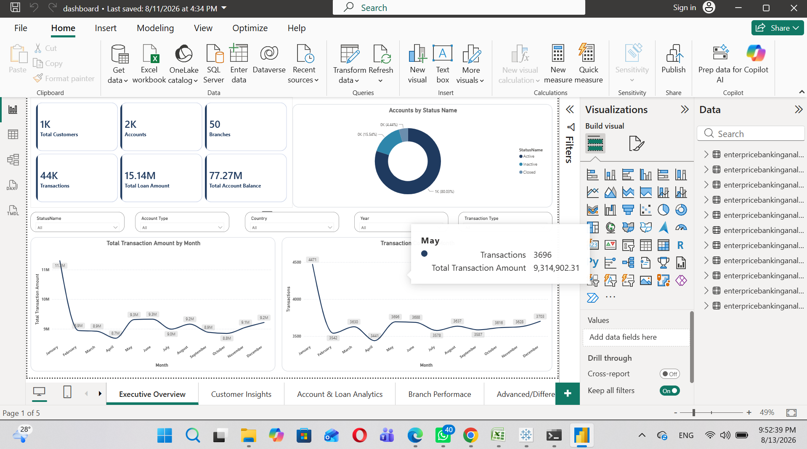
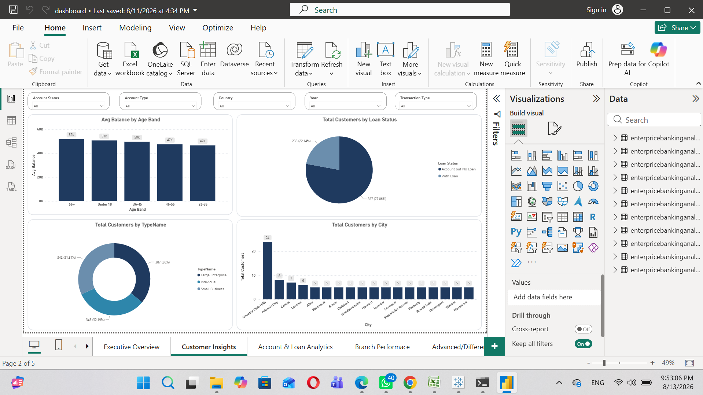
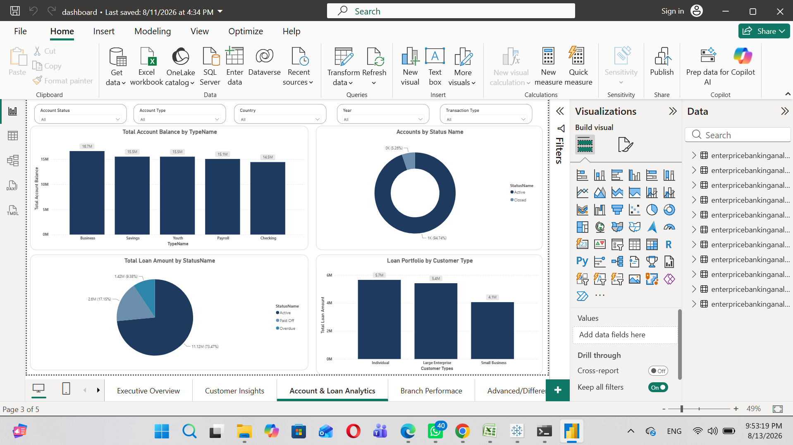
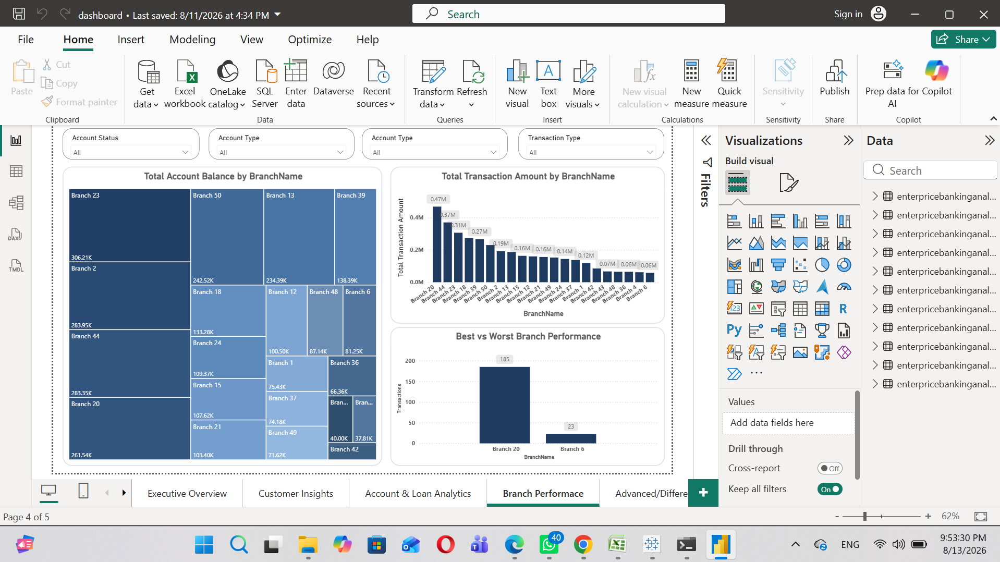
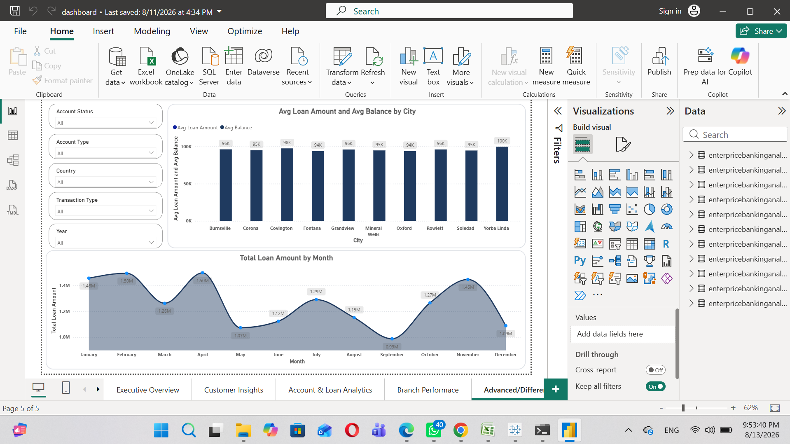

# 🏦 Enterprise Banking Analytics Project

**End-to-End Banking Analytics System** — from raw multi-table banking data to a cleaned relational database, advanced SQL analysis, Python EDA, and an interactive Power BI dashboard.


**Tools:** Python • MySQL • Power BI • SQL • Pandas • Matplotlib • Seaborn

---

## 📑 Table of Contents

- [Dashboard Preview](#-power-bi-dashboard-preview)
- [Project Overview](#-project-overview)
- [Tech Stack](#️-tech-stack)
- [Project Structure](#-project-structure)
- [Dataset](#-dataset)
- [Analysis Performed](#-analysis-performed)
- [Key Business Questions Answered](#-key-business-questions-answered)
- [How to Run](#️-how-to-run--explore)
- [Skills Demonstrated](#-skills-demonstrated)
- [Author](#-author)

---

## 🚀 Power BI Dashboard Preview

> Click on any image to open the full-size screenshot

| | |
|---|---|
| [](enterprice-banking-analytics-project/08_screenshots/dashboard_images/dashboard_image1.png) | [](enterprice-banking-analytics-project/08_screenshots/dashboard_images/dashboard_image2.png) |
| [](enterprice-banking-analytics-project/08_screenshots/dashboard_images/dashboard_image3.png) | [](enterprice-banking-analytics-project/08_screenshots/dashboard_images/dashboard_image4.png) |
| [](enterprice-banking-analytics-project/08_screenshots/dashboard_images/dashboard_image5.png) | |

---

## 📌 Project Overview

Banks generate massive volumes of data daily through customer onboarding, account management, transactions, loans, and branch operations. Raw operational data alone is not enough for strategic decisions — it needs to be cleaned, modeled, and turned into insight.

This project transforms multi-table relational banking data into **actionable business insights** using a complete analytics pipeline:

1. Business Understanding
2. Data Understanding & ER Modeling
3. Data Cleaning (Python)
4. Relational Database Design (MySQL)
5. Advanced SQL Business Analysis
6. Exploratory Data Analysis (Python)
7. Interactive Power BI Dashboard

**Key Focus Areas:**
- Customer Analytics
- Account Performance
- Transaction Trends
- Loan Portfolio Health
- Branch Performance

---

## 🛠️ Tech Stack

| Category | Tools / Technologies |
|---|---|
| **Data Cleaning & EDA** | Python, Pandas, NumPy, Matplotlib, Seaborn |
| **Database** | MySQL |
| **SQL Analytics** | Advanced SQL (CTEs, Window Functions, Joins) |
| **Visualization** | Power BI (DAX measures) |
| **Version Control** | Git & GitHub |

---

## 📁 Project Structure

```
enterprise-banking-analytics-project/
│
├── 00_Data/
│   ├── raw/                          # Original raw CSV files
│   └── cleaned/                      # Cleaned datasets ready for DB loading
│
├── 01_Business_Understanding/
│   └── Business_Understanding.md
│
├── 02_Data_Understanding/
│   ├── Data_Understanding.md
│   └── ER_Diagram.png
│
├── 03_Data_Cleaning/
│   ├── data_cleaning.ipynb
│   └── Data_Cleaning_Report.md
│
├── 04_Database_Design/
│   ├── schema_design.sql
│   └── ER_Diagram.png
│
├── 05_SQL_Business_Analysis/
│   ├── 01_Executive_KPIs.sql
│   ├── 02_Customer_Analytics.sql
│   ├── 03_Account_Analytics.sql
│   ├── 04_Transaction_Analytics.sql
│   ├── 05_Loan_Analytics.sql
│   ├── 06_Branch_Analytics.sql
│   └── 07_Cross_Functional_Analytics.sql
│
├── 06_Notebook/
│   ├── EDA.ipynb
│   └── sql_analysis_outputs.ipynb
│
├── 07_PowerBI/
│   └── dashboard.pbix
│
├── 08_screenshots/
│   ├── dashboard_images/             # Power BI dashboard screenshots
│   └── chart_images/                 # Additional analytical charts
│
└── README.md
```

---

## 📂 Dataset

Multi-table relational banking dataset (sourced from Kaggle) covering:

- Customers & Customer Types
- Accounts & Account Types / Statuses
- Transactions & Transaction Types
- Loans & Loan Statuses
- Branches
- Addresses

Cleaned files are ready for MySQL import and Power BI.

---

## 🔍 Analysis Performed

### 1. Data Cleaning (`data_cleaning.ipynb`)
- Missing value treatment
- Duplicate removal
- Data type correction
- Consistency checks
- Export of cleaned CSVs

### 2. Database Design
- Full relational schema (`schema_design.sql`)
- Primary & Foreign keys
- Proper normalization
- ER Diagram

### 3. SQL Business Analysis (7 Modules)

| Module | Focus |
|---|---|
| **01_Executive_KPIs** | Total customers, accounts, transactions, loan portfolio, average balance |
| **02_Customer_Analytics** | Customer segments, high-value customers, growth trends |
| **03_Account_Analytics** | Account type popularity, balance distribution, status analysis |
| **04_Transaction_Analytics** | Volume trends, transaction types, monthly patterns |
| **05_Loan_Analytics** | Portfolio health, status distribution, average loan size |
| **06_Branch_Analytics** | Branch performance ranking, transaction volume |
| **07_Cross_Functional** | Multi-table insights across customers, accounts & loans |

### 4. Python EDA (`EDA.ipynb`)
- Deep exploratory analysis
- Statistical summaries
- Visualizations for patterns & anomalies

### 5. Power BI Dashboard
Interactive multi-page dashboard with:
- Executive KPI cards (built with custom DAX measures)
- Customer & Account insights
- Transaction trends
- Loan portfolio overview
- Branch performance comparison
- Filters & slicers for interactive exploration

---

## 📈 Key Business Questions Answered

- How many active customers & accounts does the bank have?
- Which customer segments contribute the most?
- Which account types are most popular?
- What is the total loan portfolio size & health?
- Which branches process the highest transaction volume?
- What are the monthly transaction trends?
- Which customers hold the highest balances?
- Where should management focus for operational improvement?

---

## ▶️ How to Run / Explore

### 1. Database Setup

Run `schema_design.sql` in **MySQL Workbench** to create the database and tables, then load the cleaned CSV files into the respective tables.

### 2. SQL Business Analysis

Open any SQL file from `05_SQL_Business_Analysis/` and execute the queries in MySQL Workbench after loading the database. The folder contains analysis for:

- Executive KPIs
- Customer Analytics
- Account Analytics
- Transaction Analytics
- Loan Analytics
- Branch Analytics
- Cross-Functional Analytics

### 3. Python Notebooks

Install the required libraries:

```bash
pip install pandas numpy matplotlib seaborn
```

Launch Jupyter Notebook:

```bash
jupyter notebook
```

Then open either `06_Notebook/EDA.ipynb` or `06_Notebook/sql_analysis_outputs.ipynb`.

### 4. Power BI Dashboard

Open the dashboard in Power BI Desktop:

```
07_PowerBI/dashboard.pbix
```

You can also explore the dashboard without opening Power BI by browsing the screenshots in `08_screenshots/dashboard_images/`.

---

## 🎯 Skills Demonstrated

- End-to-end analytics project ownership
- Relational database design & MySQL
- Advanced SQL analysis — CTEs, multi-table joins, aggregations, window functions
- Data cleaning & preprocessing with Python
- Exploratory Data Analysis (EDA)
- Business-oriented insight generation
- Interactive dashboard development in Power BI
- DAX-based analytical reporting
- Data visualization and storytelling
- Structured documentation and project organization

---

## 👤 Author

**codebyavneesh**

🔗 [LinkedIn](https://linkedin.com/in/codebyavneesh) · 💼 [Fiverr](https://fiverr.com/sellers/codebyavneesh)
